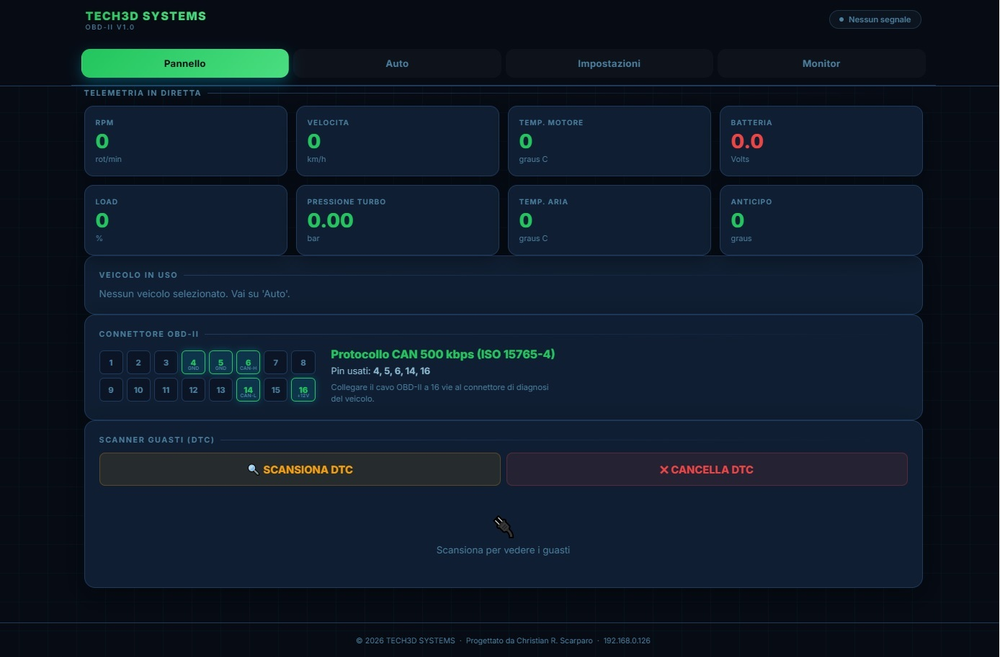
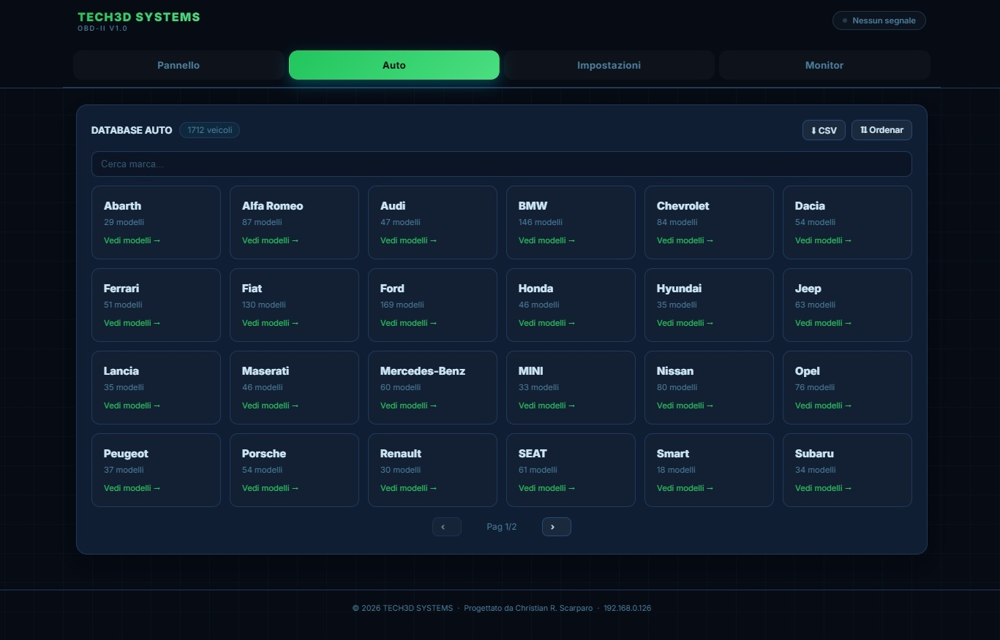
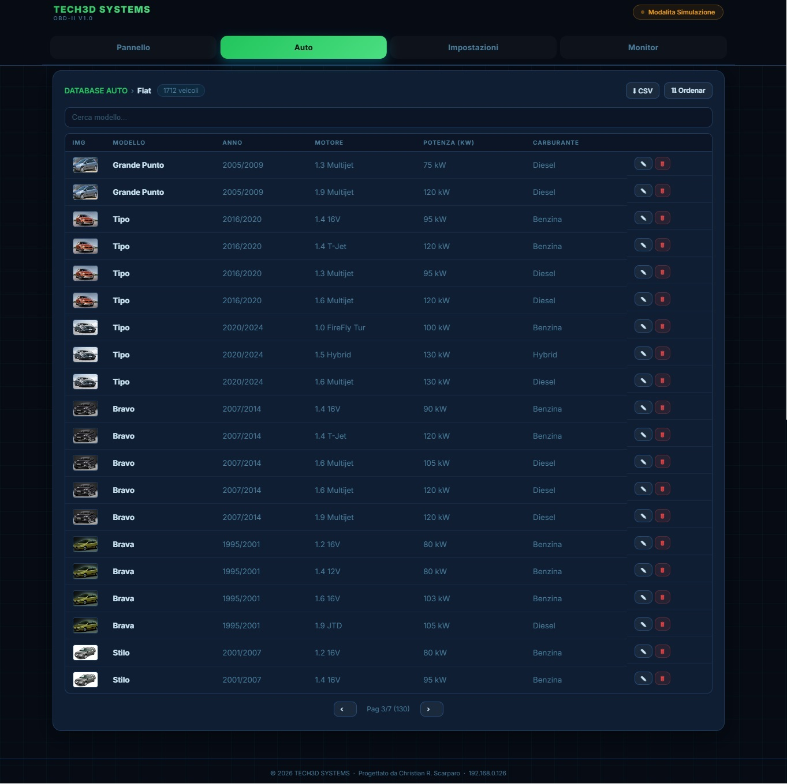
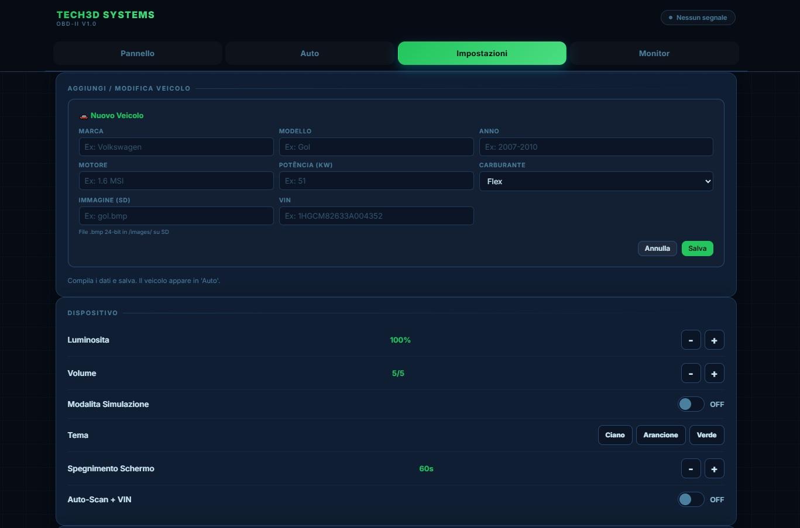
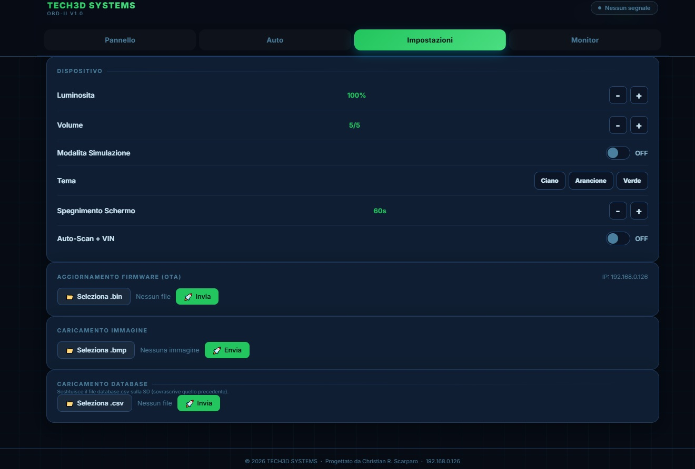
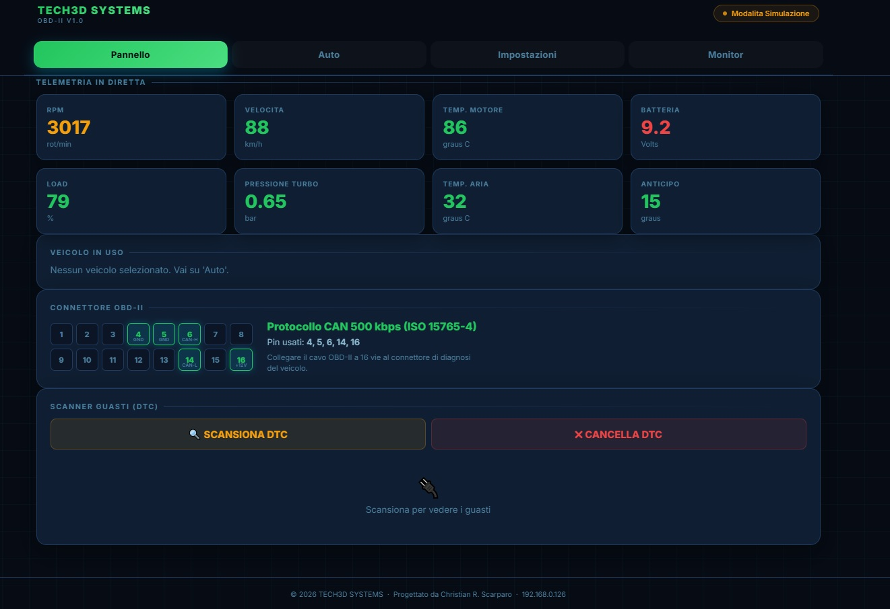
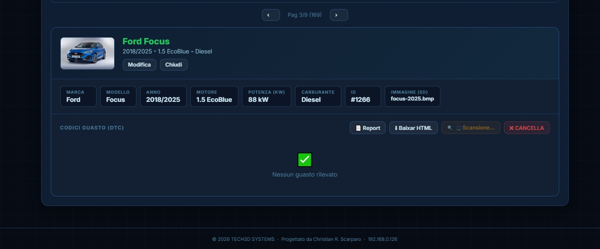
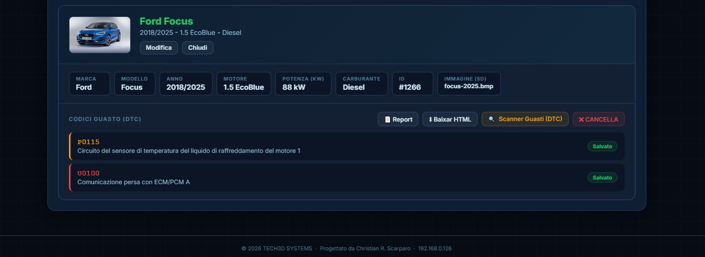
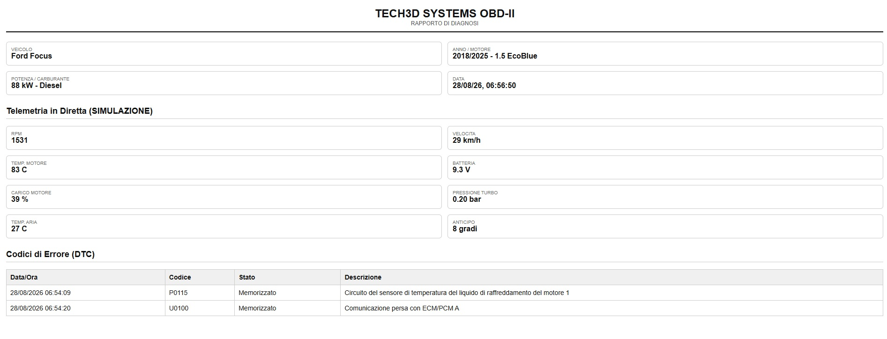

# Sistema di Diagnostica OBD-II – ESP32

> **Embedded Automotive Diagnostics · ESP32 · CAN Bus · OBD-II · ISO-TP · C/C++**

Sistema embedded per la **diagnostica automotive**, il monitoraggio del **CAN Bus** e l'analisi dei dati diagnostici del veicolo.

## Panoramica

**Sistema portatile di diagnostica elettronica automotive sviluppato su piattaforma ESP32**, progettato per l'interfacciamento diretto con il veicolo tramite **CAN Bus / OBD-II**.

Il progetto integra **hardware, firmware embedded, comunicazione CAN, gestione di database, interfaccia touchscreen e Web Interface** in un'unica piattaforma.

L'obiettivo è sviluppare uno strumento in grado di **acquisire e visualizzare parametri diagnostici del veicolo, leggere e interpretare i codici di errore (DTC) e fornire strumenti dedicati all'analisi e al monitoraggio del CAN Bus**.


---

## Caratteristiche principali

* Diagnostica automotive tramite OBD-II
* Comunicazione CAN Bus tramite controller **TWAI integrato nell'ESP32**
* Acquisizione e visualizzazione dei parametri diagnostici del veicolo
* Lettura e decodifica dei codici **DTC (Diagnostic Trouble Codes)**
* Funzione di cancellazione dei codici di errore
* Database veicoli memorizzato su **microSD**
* Database diagnostico con oltre **9.400 codici di errore**
* Display TFT a colori con touchscreen resistivo
* Dashboard per la visualizzazione dei parametri in tempo reale
* **CAN Bus Monitor** per l'analisi del traffico CAN
* Rilevamento degli identificativi presenti sulla rete CAN
* Interfaccia Web integrata per configurazione e monitoraggio
* Gestione dei dati tramite file CSV
* Generazione di report diagnostici
* Aggiornamento firmware tramite **OTA**
* Modalità di simulazione per sviluppo e validazione dell'interfaccia

---

## Architettura del sistema

Il sistema utilizza un'architettura modulare che integra i principali livelli hardware e software.

```text
                     VEICOLO
                        │
                        │ CAN / OBD-II
                        ▼
                ┌─────────────────┐
                │   CAN Bus       │
                │   Transceiver   │
                └────────┬────────┘
                         │
                         ▼
                ┌─────────────────┐
                │      ESP32      │
                │   TWAI / FW     │
                └───────┬─────────┘
                        │
          ┌─────────────┼─────────────┐
          │             │             │
          ▼             ▼             ▼
       TFT Touch      microSD       Wi-Fi
          │             │             │
          ▼             ▼             ▼
      Local UI       Database      Web Interface
                     veicoli/DTC    Dashboard
```

---

## Diagnostica OBD-II

La comunicazione con il veicolo viene gestita direttamente tramite il controller **TWAI integrato nell'ESP32**, senza utilizzare un adattatore **ELM327** come intermediario.

Il firmware gestisce la trasmissione e la ricezione dei messaggi CAN, l'elaborazione delle risposte diagnostiche e la decodifica dei parametri supportati.

### Parametri monitorati

Tra i principali parametri gestiti dal sistema:

* Regime motore (RPM)
* Velocità del veicolo
* Temperatura del motore
* Posizione acceleratore
* Carico motore
* Pressione MAP
* Temperatura aria aspirata (IAT)
* Anticipo di accensione
* Tensione batteria
* Parametri specifici del powertrain

Il sistema supporta inoltre la gestione di comunicazioni diagnostiche **multi-frame tramite ISO-TP**.

---

## Gestione dei codici DTC

Il sistema permette di leggere e interpretare i **Diagnostic Trouble Codes (DTC)** ricevuti dal veicolo.

I codici vengono associati alle informazioni disponibili nel database diagnostico e possono essere visualizzati direttamente tramite l'interfaccia del dispositivo.

Il database locale contiene oltre **9.400 codici diagnostici**, consentendo la consultazione delle informazioni senza dipendere da una connessione Internet.

---

## Database dei veicoli

Le informazioni relative ai veicoli vengono gestite tramite file **CSV memorizzati sulla scheda microSD**.

Il database comprende informazioni quali:

* Marca
* Modello
* Anno
* Motorizzazione
* Potenza
* Tipo di combustibile
* Informazioni di identificazione
* Parametri specifici del powertrain

L'architettura utilizza un sistema di **indicizzazione in RAM e caricamento on-demand**, permettendo di gestire un database di grandi dimensioni anche all'interno delle risorse limitate di un microcontrollore.

---

## Interfaccia TFT Touchscreen

Il dispositivo dispone di un'interfaccia grafica locale tramite **display TFT touchscreen**.

Le principali schermate includono:

* Dashboard
* Selezione del veicolo
* Diagnostica e DTC
* Impostazioni
* CAN Monitor
* Configurazione Wi-Fi
* Modalità di simulazione

L'interfaccia consente di utilizzare le principali funzioni del sistema direttamente dal dispositivo, senza la necessità di un computer esterno.

---

## Interfaccia Web

L'ESP32 integra un **Web Server** che permette di accedere al sistema tramite browser attraverso la rete Wi-Fi.

La Web Interface comprende funzionalità per:

* Visualizzazione dei parametri OBD
* Selezione e gestione dei veicoli
* Consultazione dei DTC
* Monitoraggio del CAN Bus
* Configurazione del dispositivo
* Gestione del database
* Upload di immagini e risorse
* Generazione e download dei report diagnostici
* Aggiornamento firmware tramite OTA

La Web Interface è stata sviluppata come parte integrante del firmware embedded.

---

## CAN Bus Monitor

Oltre alle funzioni diagnostiche OBD-II, il progetto include una modalità **CAN Bus Monitor** dedicata all'analisi del traffico sulla rete.

La funzione permette di:

* Visualizzare i frame CAN ricevuti
* Monitorare gli identificativi presenti sul bus
* Gestire frame standard ed extended
* Analizzare la frequenza di ricezione
* Effettuare una scansione passiva degli ID presenti sulla rete
* Supportare identificativi CAN a **11 e 29 bit**

Il CAN Monitor è stato sviluppato come strumento di supporto per attività di **analisi, diagnostica e troubleshooting delle comunicazioni CAN**.

---

## Hardware

Componenti principali utilizzati nel prototipo:

* **ESP32 DevKit**
* Transceiver CAN **SN65HVD230**
* Display TFT touchscreen
* Modulo microSD
* Interfaccia Wi-Fi integrata nell'ESP32
* Circuiti e cablaggi di interfacciamento

Il sistema è stato assemblato e testato come prototipo funzionante su banco.

---

## Software e tecnologie

### Embedded

* ESP32
* Arduino Framework
* C/C++
* Firmware embedded
* TWAI / CAN
* ISO-TP

### Hardware

* CAN Bus
* OBD-II
* SN65HVD230
* TFT Touchscreen
* microSD
* SPI

### Web

* HTML
* CSS
* JavaScript
* Web Server
* REST API

### Gestione dati

* CSV
* Database locale su microSD
* Indicizzazione in RAM
* Caricamento on-demand
* Generazione di report HTML

---

## Esempi tecnici

Sono disponibili alcuni esempi selezionati in **C/C++** che illustrano i principali concetti tecnici implementati nella piattaforma.

* [CAN Communication Example](examples/CAN_Communication_Example.cpp)

  * Configurazione del controller TWAI dell'ESP32
  * Trasmissione e ricezione di frame CAN
  * Gestione di identificativi CAN standard ed extended

* [OBD-II Request Example](examples/OBD2_Request_Example.cpp)

  * Richieste OBD-II Mode 01
  * Costruzione delle richieste tramite PID
  * Trasmissione CAN tramite TWAI

* [DTC Decoding Example](examples/DTC_Decoding_Example.cpp)

  * Elaborazione dei dati diagnostici ricevuti
  * Identificazione della categoria del DTC
  * Conversione dei dati grezzi in codici DTC leggibili

> Gli esempi sono versioni semplificate e indipendenti, pubblicate per documentare alcuni degli approcci tecnici utilizzati nel progetto. Il firmware completo e la logica applicativa proprietaria non sono inclusi nel repository pubblico.


## Funzionalità avanzate

Il progetto integra diverse funzionalità sviluppate per migliorare la flessibilità del sistema durante le attività di sviluppo, test e diagnostica.

### Modalità simulazione

È disponibile una modalità di simulazione che consente di testare l'interfaccia e le principali funzioni del sistema anche in assenza di un veicolo collegato.

Questa modalità è particolarmente utile durante lo sviluppo e la validazione del firmware e dell'interfaccia utente.

### Aggiornamento OTA

Il firmware può essere aggiornato tramite la Web Interface utilizzando la funzione **Over-The-Air (OTA)**.

### Configurazione persistente

Le impostazioni del dispositivo vengono memorizzate nella memoria non volatile dell'ESP32, consentendo di mantenerle anche dopo il riavvio del sistema.

---

## Test e validazione

Durante lo sviluppo sono state effettuate attività di:

* Test della comunicazione CAN
* Verifica della ricezione e trasmissione dei frame
* Test della comunicazione OBD-II
* Verifica della decodifica dei parametri
* Test di lettura dei DTC
* Test del database diagnostico
* Test del database veicoli
* Test dell'interfaccia touchscreen
* Test della Web Interface
* Test della gestione microSD
* Debug del firmware
* Verifica dell'integrazione hardware/software

Il sistema è stato sviluppato e validato progressivamente attraverso diverse revisioni del firmware, dell'hardware e dell'interfaccia utente.

---

## Obiettivi del progetto

Il progetto nasce dall'interesse per l'integrazione tra **elettronica, sistemi embedded, firmware e diagnostica automotive**.

L'obiettivo è continuare a sviluppare la piattaforma introducendo nuove funzionalità diagnostiche, ampliando il supporto a diversi modelli di veicolo e migliorando gli strumenti dedicati all'analisi del CAN Bus.

---

## Tecnologie

**ESP32 · C/C++ · Embedded Systems · Firmware · CAN Bus · OBD-II · ISO-TP · TWAI · TFT Touchscreen · microSD · Wi-Fi · HTML · CSS · JavaScript · REST API · Automotive Electronics**

---

## 📸 Interfaccia del sistema

Le immagini seguenti mostrano alcune delle principali schermate dell'interfaccia sviluppata.

### Dashboard





### Selezione veicolo



### Impostazioni





### Modalità simulazione



### CAN Monitor





### Report diagnostico



---


## Stato del progetto

**Stato:** Prototipo funzionale

Il sistema è stato sviluppato e testato come prototipo embedded funzionante, integrando hardware, firmware, comunicazione CAN, diagnostica automotive, gestione locale dei dati e interfaccia Web.

Il progetto è in continua evoluzione, con futuri sviluppi orientati all'ampliamento della compatibilità con diversi modelli di veicolo, all'estensione delle funzionalità diagnostiche e al miglioramento degli strumenti di analisi del CAN Bus.

---

## Autore

**Christian Roger**

Embedded Systems · Elettronica · Diagnostica Automotive · ESP32 · CAN Bus · Sviluppo Firmware 
